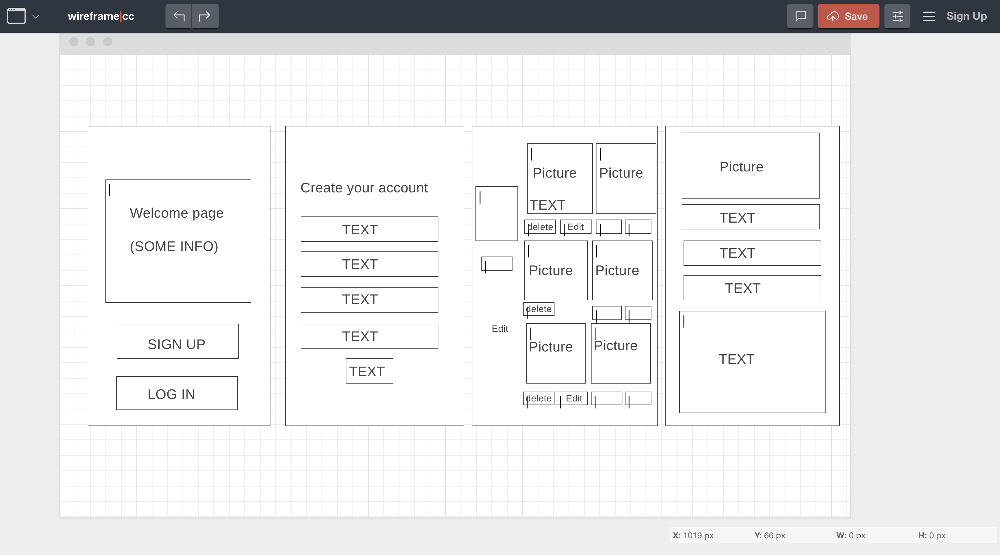
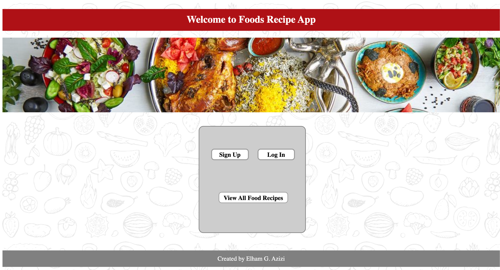
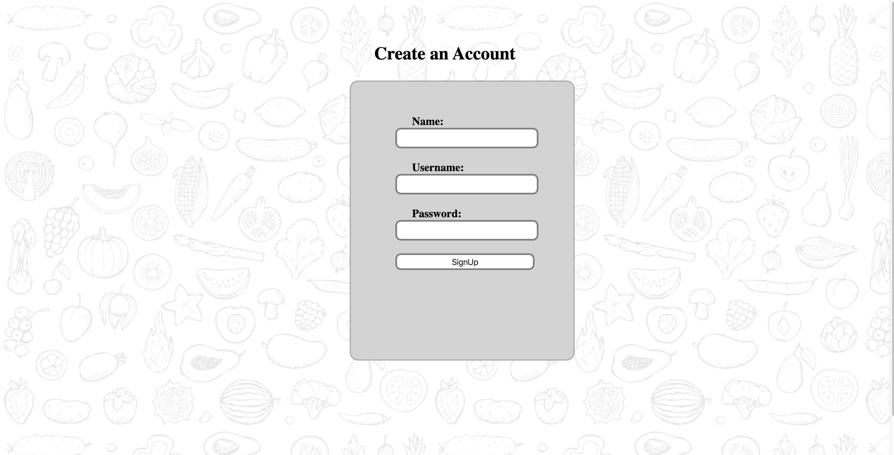
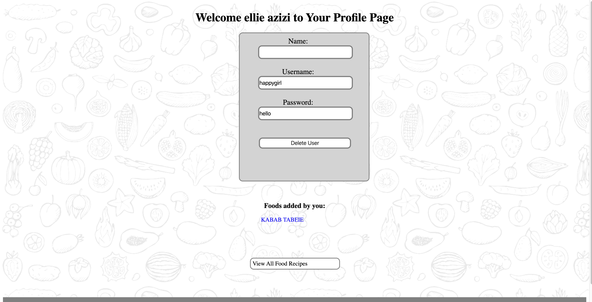

# food-recipe-app

## Project Description:

Food Recipe App is an application that is designed to allow users to easily share and view recipes.

## Find the link here:

Deployed at https://myfoodappdemoelham.herokuapp.com/users .

## Wireframe:

## User Stories:

User is able to check the persian food recipes w/o logging in or creating an account. User can sign up or log in to the created new reipes and added to main page. 

## Button Interaction:

1. Sign Up: user has to create and account to save he's recipes.
2. Log In: User would be able to go back and check the saved recipes.
3. Delete: remove the recipe from the homepage.
4. Edit: modify the recipe with your version.
5. clicking on the names of the food: Directs to to the recipe of the selected picture. 
6. Create a New Persion Recipe: Direct the user to new page to create a new recipe. 

## App Demo: 

## Technologies used:
- MySql
- Node.js
    - Express
        - get
        - post
        - put
        - use
    - mysql
    - Sequelize
- Materialize Framework
- HTML
- CSS
- jQuery
- Ejs
- Packages: npm, npx
- Vanila Javascript
    - constructors
- MySQL
    - SQL
        - CREATE DATABASE
        - USE DATABASE
        - CREATE TABLE
        - INSERT INTO
        - ALTER TABLE
        - SELECT
        - UPDATE
